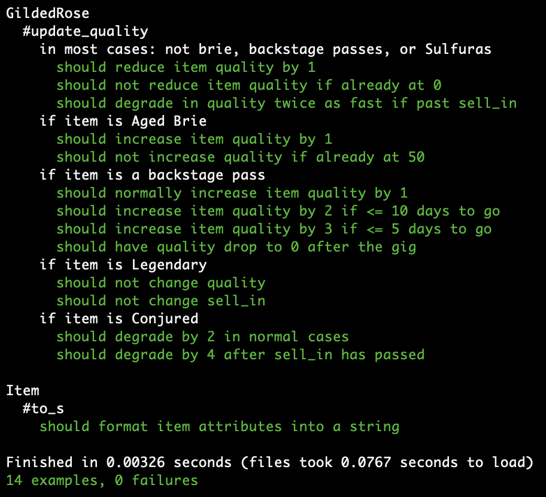
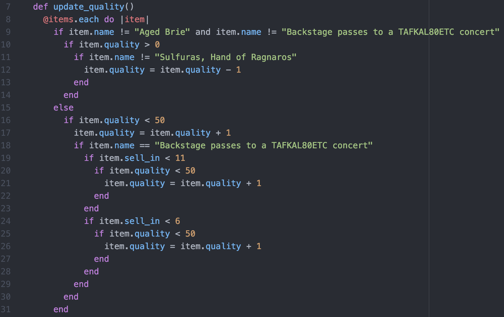
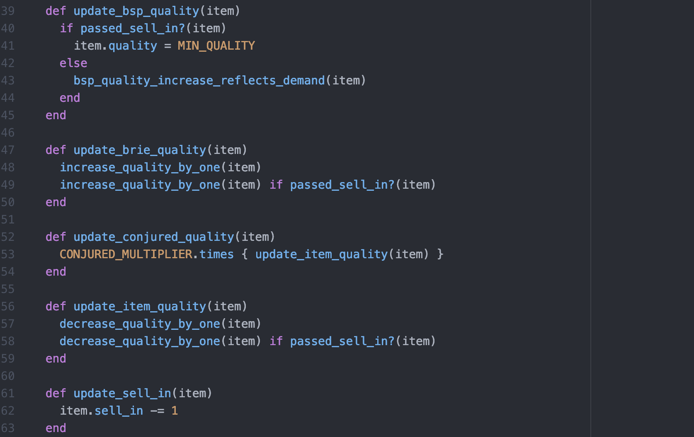

**See ORIGINAL_README for further details about this kata**

# Gilded Rose Refactoring Kata

## How to run

* Clone this repository

* Enter bundle install in the command line to install dependencies

* Require item.rb and gilded_rose.rb from within irb

* Create new items, pass them as an array when initializing Gilded Rose, and update them with the update_quality method.

* To run tests enter rspec in the command line

## Approach

* Added comments to gilded_rose.rb to gain a better understanding of what the code was doing in specific parts and demystify the nested conditional statements.

* Wrote a passing test suite to prevent regression while refactoring.

* Refactored at a basic level - rearranged if statements and removed obviously unnecessary code.

* Diagrammed/ modelled in order to determine methods I would likely need (e.g. one for Aged Brie, one for Backstage Passes, one for Sulfuras, and finally one for conjured items).

* Wrote methods for specific parts of the code as outlined in the previous step.

* Commented out the original code, replacing it with the relevant method to test if behaviour was unchanged (i.e. if all tests passed).

* If so, removed the original code. Debugged if this was not the case.

* Continued this process until there were no nested conditionals!

* Refactored further, adding constants and private methods to improve code clarity and abide by SRP as much as possible.

## Thoughts

* This was a very enjoyable practice in refactoring. It felt great making progress on what was initially incomprehensible code.

* I questioned whether to mock the Item class in my Gilded Rose tests. I opted against this, as this was primarily an exercise in refactoring, and the Item class should always remain unchanged per the requirements.
